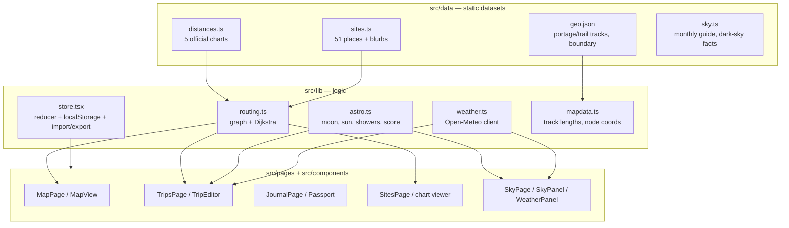

# Architecture

## 1. Stack

| Layer | Choice | Why |
|---|---|---|
| Build | Vite 5 + TypeScript 5 | fast, zero-config, `base: './'` makes the bundle host-agnostic |
| UI | React 18 (no router lib) | hash-based routing in ~30 lines keeps deps minimal |
| Map | Leaflet 1.9 (vanilla, thin React wrapper) | full control over markers/overlays, no react-leaflet version coupling |
| State | hand-rolled reducer + Context, persisted to `localStorage` | the entire app state is one serializable document |
| Tests | Vitest | covers the two algorithmic cores: chart routing & astronomy |
| Styling | one global CSS file with custom properties | a design system small enough to read in one sitting |

Runtime dependencies are exactly four: `react`, `react-dom`, `leaflet`, and
`@supabase/supabase-js` — the last added in M3 for optional accounts + sync
(auth sessions and the Postgres-backed sync adapter); when its env vars are
unset the client is `null` and the app stays purely local.

## 2. Module map



## 3. The routing design (the interesting part)

The Friends of Keji charts are **all-pairs distance tables**, not edge lists.
Three properties shaped the design:

1. **The charts are the authority.** If two stops appear in the same chart, the app
   returns that exact printed value (`exact: true`), even where the chart disagrees
   with itself by a few hundred metres. Users compare against the paper chart; the
   app must match it.
2. **Charts must be stitched for cross-region trips** (e.g. Big Dam → Peskawa).
   All chart cells become edges of a weighted graph per mode (paddle/hike); Dijkstra
   finds the cheapest stitch through shared nodes (Site 11, Site 24, launches…).
   Results are flagged `exact: false` and rendered with “≈”.
3. **Portage rows are display-only.** The charts measure “Portage X” cells from
   whichever *end* of the portage is closer, so a portage node in the graph would
   let routes transit a 2 km carry for free. Portage cells are excluded from the
   graph (but shown in the chart viewer); routing stitches only through real points.

A short `EXCLUDED_EDGES` list drops cells that break the triangle inequality within
their own chart (documented in `docs/DATA.md`). `EXTRA_EDGES` adds estimated
connectors for the one bookable place missing from all charts (Wil-Bo-Wil cabin).

Travel time = distance ÷ user-set pace (defaults: paddle 4 km/h, hike 3.5 km/h);
portage time is already inside the paddling chart figures.

## 4. Astronomy

- **Moon**: mean synodic cycle from the 2000-01-06 epoch → phase, age, illumination.
  Accurate to a few hours — more than enough for “is the Milky Way worth it”.
- **Sun & darkness**: NOAA sunrise equation at −0.833° (rise/set) and −18°
  (astronomical twilight) for 44.4° N, 65.22° W.
- **Stargazing score**: `100 × (1 − 0.75·moonIllum) × (1 − 0.9·cloud/100)`, +12 on a
  meteor-shower peak night, clamped to 0–100. Cloud comes from the weather layer’s
  21:00–23:00 mean when available.
- **Monthly guide** (`data/sky.ts`): hand-curated for the latitude; pure content.

## 5. Weather

`tripWeather(start, nights)` picks the right Open-Meteo endpoint:

| Trip dates | Source | Label in UI |
|---|---|---|
| past | `archive-api.open-meteo.com/v1/archive` | “what actually happened” |
| ≤ 16 days out | `api.open-meteo.com/v1/forecast` | forecast |
| beyond | archive, same dates −1 year | “hint only” |

Daily values + hourly cloud cover (evening mean feeds the stargazing score).
`windWarning()` flags gusts that make the big lakes dangerous for open canoes.

## 6. State & the multi-user path

All user data is one document (`AppData`, version-tagged) behind a single reducer:

```
campers[] · trips[] · memories[] · settings
```

- Persistence is a `useEffect` that serializes to `localStorage`.
- Export/import merges by id (`import/merge` action), which already gives
  “sneakernet multiplayer”: friends exchange JSON files and see each other’s
  memories and stamps.
- **Going multi-user** means swapping persistence, not rewriting features:
  every mutation flows through the reducer’s typed actions, so a sync adapter
  (Supabase/PocketBase) can replay the same actions against a backend and
  subscribe to remote changes. Suggested mapping: one Postgres table per entity,
  `crew_id` scoping, row-level security, photos to object storage (they are
  data-URLs today specifically to keep that swap mechanical).

M3 implements exactly this sync adapter (per `docs/M3-REVIEW.md`): a pure core
in `src/lib/sync.ts` (baseline diffing, op coalescing, inbound planning — no
React, supabase, or browser globals, fully unit-tested) with a thin adapter in
`src/lib/useSync.tsx` that owns localStorage, the network, and the dispatch
loop — one Postgres table per entity, owner-scoped RLS, and the reducer
untouched as the single write path.

## 7. Map & route geometry (v0.2)

`MapView` is created once per mount; props drive three reactive layers:
markers (recoloured on selection/visited), a route overlay, and static
overlays (boundary, trails, portages with computed lengths from the GPX tracks).
Tiles: Esri World Topo (default), OSM, Esri Imagery — all keyless.

Route overlays are true-to-terrain (`src/lib/routegeo.ts`):
- **hike** hops A* over a network built at runtime from the shipped trail +
  portage tracks (tracks joined where endpoints come within 120 m; stops
  snapped within 400 m)
- **paddle** hops look up precomputed water corridors
  (`src/data/waterways.json`, see docs/DATA.md §3b)
- any hop the data can't support renders as a dotted **schematic** line
Distances and times always come from the charts, never from this geometry.

## 7b. Sharing (v0.2)

- **Share links**: the trip is deflate-compressed into the URL fragment
  (`#/view/<payload>`, `src/lib/share.ts`) — a read-only viewer that needs no
  account and saves nothing until the viewer clicks “save a copy”.
- **Share cards**: `src/lib/sharecard.ts` draws 1080×1350 trip cards and
  1080×1080 memory cards on canvas from our own vector data (no tiles → no
  CORS/licensing issues), delivered via the Web Share API or download.
- **Stamps** (`src/components/Stamp.tsx`): deterministic generative SVG per
  site (id seeds rotation/ink/wear); **badges** (`src/lib/badges.ts`) are pure
  functions over trips + memories.
- **PWA shell**: `public/sw.js` caches same-origin assets stale-while-
  revalidate so the app opens offline; tiles and weather stay network-only.

## 8. Testing & CI

- `tests/routing.test.ts` — chart shape invariants, exact-value guarantees,
  cross-chart stitching sanity, mode coverage, symmetry.
- `tests/astro.test.ts` — known new/full moons, solstice sunset window, shower
  windows (incl. year-wrap), score ordering.
- `docs/ci/deploy.yml` (move it to `.github/workflows/` to enable) runs tests + build on push to `main` and
  publishes `dist/` to GitHub Pages.
